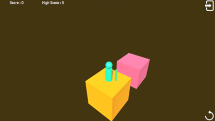
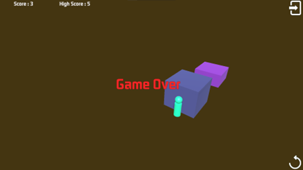
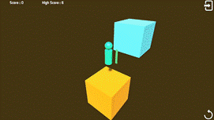

# Weekly Class Journal
___
## January 15-22 - Week 1 Design Journal – Make a Thing
This week, I wanted to see if I could make a small but complete playable game within a very limited amount of time. I was also interested in figuring out which parts of game development are worth spending time on when working on a short prototype. 

Before starting the project, I tried working with both Bitsy and Unity. Bitsy feels more focused on storytelling and emotional expression through text and simple spaces, while Unity makes it easier to build game mechanics by using existing systems. Since I’m not very comfortable coming up with a strong theme or story in a short amount of time, I decided to use Unity and focus more on mechanics and interaction instead.

Because of the time limit, I intentionally kept the controls very simple and limited the game to a single button for jumping. I also decided not to design handcrafted levels. Instead, I chose an endless, procedurally generated structure. This helped reduce the amount of content I needed to make and allowed me to spend more time testing whether the core gameplay idea worked.

During early testing, I expected the game to be easy to learn. However, I quickly noticed that the jump was hard to judge because of the current values (jump force, max distance, min distance etc..), which made the game much more difficult than I had planned. This showed that even in a very small and seemingly simple game, things like number tuning and difficulty curves have a big impact on how the game feels to play.

If I were to continue working on this prototype, I would first focus on adjusting the jump values to see if that makes the game easier to master for beginners. I would also want to observe how these changes affect the overall difficulty.
___