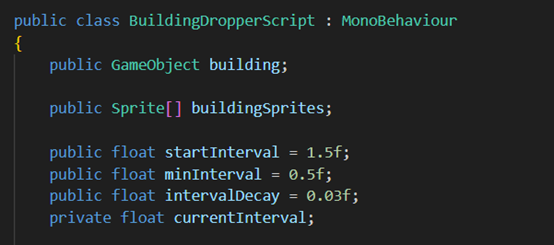
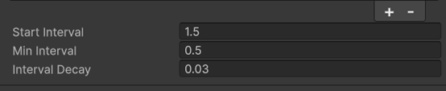
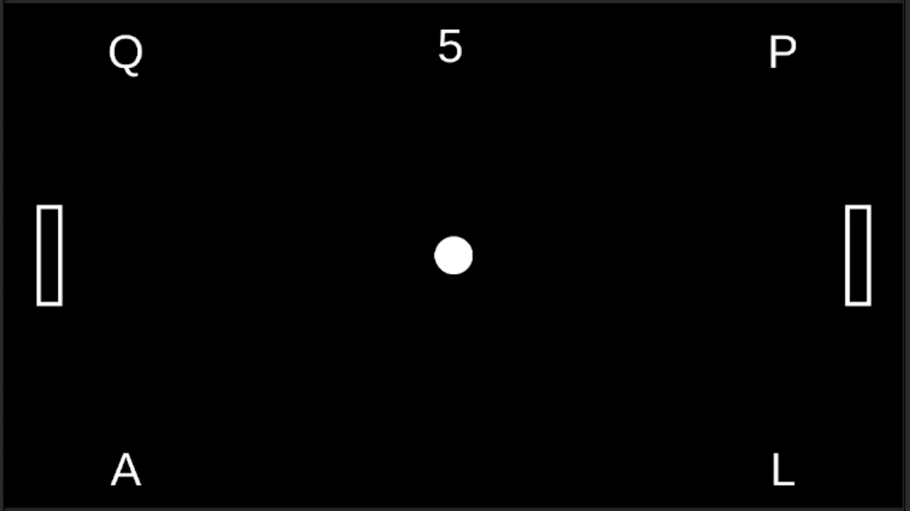
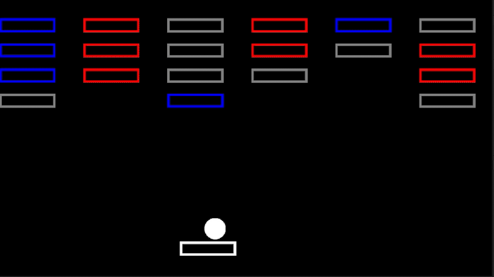
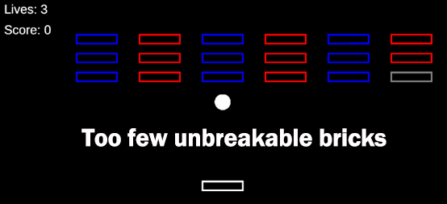
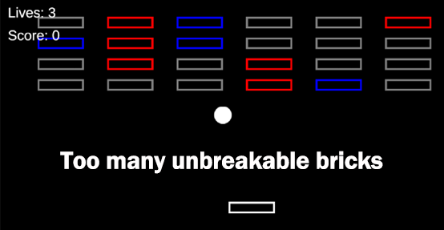
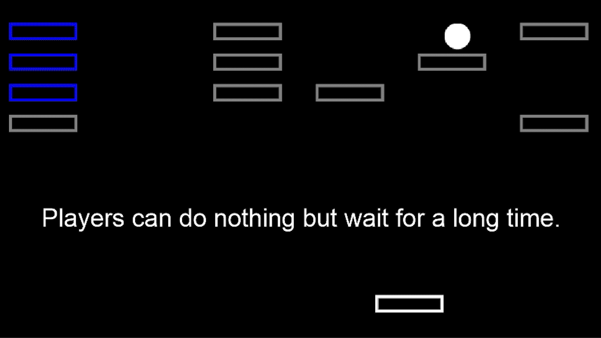

# Weekly Class Journal
___
## January 15-22 - Week 1 Design Journal – Make a Thing
This week, I wanted to see if I could make a small but complete playable game within a very limited amount of time. I was also interested in figuring out which parts of game development are worth spending time on when working on a short prototype. 

Before starting the project, I tried working with both Bitsy and Unity. Bitsy feels more focused on storytelling and emotional expression through text and simple spaces, while Unity makes it easier to build game mechanics by using existing systems. Since I’m not very comfortable coming up with a strong theme or story in a short amount of time, I decided to use Unity and focus more on mechanics and interaction instead.

Because of the time limit, I intentionally kept the controls very simple and limited the game to a single button for jumping. I also decided not to design handcrafted levels. Instead, I chose an endless, procedurally generated structure. This helped reduce the amount of content I needed to make and allowed me to spend more time testing whether the core gameplay idea worked.

During early testing, I expected the game to be easy to learn. However, I quickly noticed that the jump was hard to judge because of the current values (jump force, max distance, min distance etc..), which made the game much more difficult than I had planned. This showed that even in a very small and seemingly simple game, things like number tuning and difficulty curves have a big impact on how the game feels to play.

If I were to continue working on this prototype, I would first focus on adjusting the jump values to see if that makes the game easier to master for beginners. I would also want to observe how these changes affect the overall difficulty.
___
## January 22-29 – Week 2 Design Journal - Exploration Prototype 1
This week, my work focused on exploring and modifying the example project Gotta Catcha Mall, rather than starting a new game from scratch. Since the Tiny Game from the previous week was already completed, I treated this prototype as a way to better understand how an existing game works and how small changes to its rules and values can significantly affect how the game feels to play.

### Exploration
My main goal this week was to see how difficulty can be shaped through timing and pacing rather than by adding more mechanics. I wanted to explore how changing the speed at which objects are generated would affect the overall pace of the game in a very simple structure.
Instead of making the game more complex, I focused on modifying a single system and observing how that change altered the feel of the game.

### What I Modified
The main modification I made was to the spawn system. Originally, buildings were generated at a fixed interval. I changed this so that the spawn interval gradually decreases over time, meaning buildings start falling faster the longer the game runs.
I added a starting interval, a minimum interval, and a decay value so that the game becomes more intense but still has a limit. This created a simple difficulty ramp without introducing any new mechanics or rules.

### Observation
With a fixed spawn speed, the game felt predictable and easy to manage once the player understood the rules. After adding the decaying spawn interval, however, the experience changed noticeably.
As the game progressed and buildings began falling more frequently, I felt more pressure to make quick decisions about what to catch and what to avoid. Mistakes happened more often, because there was less time to react and reposition the basket.
As the speed increased, it became much more obvious that the game is built around choosing what to catch and what to avoid. The increasing speed made it much more obvious that the player needs to recognize which objects are worth catching and intentionally avoid others. The difficulty came from decision-making under pressure, not just from reaction speed.

### What I Learned 
This small change showed me how much impact a single numerical system can have on the overall experience. Even though the mechanics stayed exactly the same, the game felt very different once the pacing changed.
I also learned that difficulty does not need to come from adding more features. Simply adjusting timing and rhythm can create a stronger sense of tension and progression, especially in a prototype meant to test a single idea.

### What Worked
I would consider this exploration successful because it clearly demonstrated how a difficulty curve can emerge from a simple system. The prototype helped me understand how pacing influences player behavior and how quickly a game can become stressful or overwhelming when time pressure increases.

### Where I Might Go Next
If I were to continue exploring this idea, I would experiment with fine-tuning the rate at which the spawn interval decreases to find a better balance between challenge and readability. I would also be interested in testing whether clearer visual or audio feedback could help players make faster decisions as the game speeds up.
___

## January 30 – February 4 – Week 3 - Design Journal: Exploration Prototype 2
This week, I modified the example game Pawng that we discussed in class by introducing randomized player inputs. Instead of each player having fixed and reliable controls, the control keys are shuffled at regular intervals during gameplay.
The purpose of this change was to explore whether introducing randomness into a simple competitive game could add moments of surprise or engagement, and under what conditions this randomness begins to feel disruptive rather than playful.

### What I Was Trying to Test
I was interested in observing how players adapt in real time when their inputs are no longer reliable.
Rather than evaluating the game at a high level, I focused on moment-to-moment reactions, especially how players respond when the control scheme changes during active play.
More specifically, I wanted to understand whether randomness could create interest without breaking the player’s sense of agency, and how timing plays a role in how this randomness is perceived.

### What I Did
I kept the core mechanics of Pawng unchanged. I did not add any new rules or objectives. The paddles still move vertically, collide with the ball, and follow the same logic as the original version.
My only change was to the input system. I introduced a timer that randomly reassigns the control keys for each player at regular intervals. To avoid making this change feel hidden or confusing, I added a simple UI element that displays the current key mapping along with a countdown indicating when the next change will occur.

### What I Learned
After implementing this change, I noticed that even a small modification to the input system had a strong effect on how the game was played. In some situations, the randomized input created moments of surprise and tension. When players managed to adapt quickly to the new controls, these moments felt playful and occasionally humorous.
However, I also observed a clear point where the randomness began to feel frustrating rather than engaging. When the key shuffle happened just as the ball was approaching the paddle, players often had too little time to react. In these moments, I noticed that missed shots were usually blamed on the system rather than on player skill.
From this, I learned that randomness itself was not the main issue. Instead, the timing of the randomness was critical. When players felt they had enough time to adjust, the randomness felt challenging but fair. When they did not, it felt arbitrary and disruptive.

### Was It Successful?
I consider the prototype successful because it showed how the timing of randomized input strongly affects player experience. While introducing randomness did create moments of interest, it also revealed how quickly a player’s sense of control and responsibility can break down when that randomness is introduced at the wrong moment.
Rather than trying to make the game “better” overall, this prototype helped me identify a specific design boundary: randomness can enhance play, but only when players are given enough time to respond and adapt.

### Where I Might Go Next
If I were to continue this exploration, I would like to expand the scope of randomness rather than focusing on a single variable.
In this prototype, the randomness was primarily temporal, affecting when player input changed.
The next step would be to introduce an additional randomized variable, such as changes to paddle size, and observe how multiple forms of randomness interact. I would be interested in whether combining these variables amplifies the sense of unpredictability, or whether one form of randomness becomes more noticeable than the other.
This would help explore how much randomness a simple game system can support before it becomes unreadable or overwhelming.
___

## February 5-11 - Week 4 - Design Journal: Exploration Prototype 3
### Idea
This week, I added a new brick property to the original Breakin’ Out game, where some bricks generated by the system cannot be destroyed.
Instead of trying to make the game harder, I wanted to see what happens when levels are generated procedurally, and what kinds of problems show up during play.

### What I Was Trying to Test
I wanted to see what happens when unbreakable bricks are added to procedurally generated levels.
More specifically, I was interested in figuring out which parts of a level layout can be left random to keep the game interesting and replayable, and which parts need some control to avoid frustrating or unexpected situations.

### What I Did
To explore this idea, I modified the brick generation system so that some bricks can be generated as unbreakable. When the level is created, each brick has a chance of becoming an unbreakable brick instead of a normal one. These unbreakable bricks are visually different and when the ball collides with these bricks they are not destroyed and continue to interact with the ball through normal collision physics. They act as obstacles that the player has to work around.
In addition to adding unbreakable bricks, I tested the system across different generated layouts by adjusting the number of rows, columns, and spacing between bricks. This allowed me to observe how the presence of unbreakable bricks affected playability under different layout conditions.

### What I Learned 
Through testing different generated layouts, I started to see that randomness needs to stay within a certain range. When the chance of unbreakable bricks was too low, only one or two would appear, and they barely changed the game. The level felt almost the same every time, which defeated the purpose of procedural generation.
On the other hand, when the chance was too high, the levels became much more chaotic. Large groups of unbreakable bricks would sometimes form, making certain areas very hard to reach. In some cases, the ball would just bounce between unbreakable bricks for a long time, and I felt like the player wasn’t really making meaningful decisions anymore — they were just waiting for the ball to drop or hoping for a lucky angle.

These observations made me realize that procedural generation is not just about whether a level is technically beatable. Even if a level can be completed in theory, it doesn’t necessarily mean it feels fair or enjoyable. If the probability of success becomes too low, the game starts to rely more on luck than on player skill.
From this experiment, I learned that randomness in procedural level generation needs boundaries. Too little randomness makes the game repetitive, but too much can create extreme difficulty spikes and reduce the player’s sense of control.

### Was It Successful?
I consider this prototype successful because it made the problems of procedural generation very visible. By adjusting the probability of unbreakable bricks, I could clearly see when the game felt repetitive and when it became frustrating.
Even though I did not fully optimize the system, the prototype helped me understand that randomness needs structure in order to create levels that feel fair and engaging.

### Where I Might Go Next
If I continue developing this idea, I would like to apply what I learned about controlled randomness to other types of games, such as roguelikes. In those games, procedural generation is often used to determine enemy placement and difficulty.
For example, the proportion of strong enemies versus weaker enemies could be adjusted within a controlled range, similar to how I adjusted the probability of unbreakable bricks. This would help ensure that levels remain challenging but still give players a reasonable chance of success.
This experiment made me more aware that random systems need boundaries, especially when they directly affect difficulty and survival probability.
___

## February 12-18 Week 5 - Design Journal: Exploration Prototype 4
### Idea
In Prototype 3, I focused on procedural level generation and added constraints to unbreakable bricks. The goal was to prevent extreme layouts and keep the game playable while still allowing variation.
This week, I wanted to push the gameplay system further by making it react to the player’s behavior. Instead of keeping the level static, I introduced a performance-based trigger. If the player clears a certain number of bricks within a short time window, the game shifts into a harder mode where the bricks begin to move horizontally and award higher points.
Rather than only adjusting randomness at the generation stage, I wanted to explore what happens when the system dynamically responds to player performance during gameplay.

### What I Changed
Building on the constrained procedural generation from last week, I added a timed performance condition. The system now tracks how many bricks are destroyed within a rolling time window. If the player reaches a target number within that window, the game activates a “hard mode.”
When hard mode is triggered:
* All remaining breakable bricks change color.
* Their point value increases.
* The entire brick layer begins to move horizontally over time.
This change transforms the level from a fixed layout into a responsive system that reacts to good performance.

### What This Change Tests
This iteration tests whether performance-based dynamic difficulty can increase challenges while still maintaining a sense of fairness and control.
Instead of only modifying randomness at the generation stage, I wanted to explore how players perceive when the system reacts directly to their performance during play.

### What I Learned
During testing, I noticed that players often felt surprised when hard mode was triggered for the first time. The sudden shift in movement and increased scoring created a sense of excitement. Over time, this mode became something players actively tried to reach again, which increased replay motivation and made the game feel less repetitive.
However, I also realized that the activation condition needs to be carefully balanced. If the requirement to enter hard mode is too difficult, many players may never experience it and may not even realize that such a mode exists. On the other hand, if the condition is too easy, hard mode starts to feel inevitable rather than earned. In that case, the difficulty shift no longer feels like recognition of strong performance, but simply a normal progression of the game.
This made me understand that dynamic difficulty is not only about increasing challenge, but also about designing meaningful thresholds that preserve a sense of achievement.

### Was It Successful?
I consider this prototype successful because it made the impact of performance-based triggers clearly visible. Through testing different conditions, I was able to observe how small changes in the activation threshold significantly affected player motivation and perception.
When the trigger felt challenging but achievable, hard mode became something players actively pursued. However, when the condition was either too strict or too easy, the system lost its intended effect. This confirmed that dynamic difficulty is not only about adding challenge, but about carefully designing when and how that challenge is introduced.

### Where I Might Go Next
While this prototype focused on rewarding strong performance with increased challenge, it also raised another important question: how should the system respond to weaker performance?
If high-performing players are rewarded with hard mode, should players who struggle receive some form of assistance? For example, the game could provide temporary support, such as granting an extra life after repeated failures. Exploring this possibility could become my next step.
___
