# Weekly Class Journal
___
## January 15-22 - Week 1 Design Journal – Make a Thing
This week, I wanted to see if I could make a small but complete playable game within a very limited amount of time. I was also interested in figuring out which parts of game development are worth spending time on when working on a short prototype. 

Before starting the project, I tried working with both Bitsy and Unity. Bitsy feels more focused on storytelling and emotional expression through text and simple spaces, while Unity makes it easier to build game mechanics by using existing systems. Since I’m not very comfortable coming up with a strong theme or story in a short amount of time, I decided to use Unity and focus more on mechanics and interaction instead.

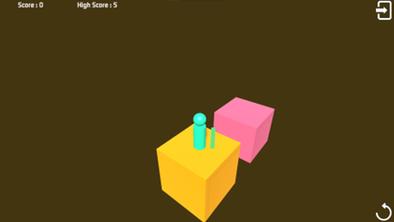
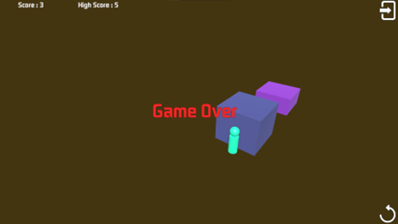

Because of the time limit, I intentionally kept the controls very simple and limited the game to a single button for jumping. I also decided not to design handcrafted levels. Instead, I chose an endless, procedurally generated structure. This helped reduce the amount of content I needed to make and allowed me to spend more time testing whether the core gameplay idea worked.

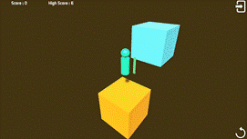

During early testing, I expected the game to be easy to learn. However, I quickly noticed that the jump was hard to judge because of the current values (jump force, max distance, min distance etc..), which made the game much more difficult than I had planned. This showed that even in a very small and seemingly simple game, things like number tuning and difficulty curves have a big impact on how the game feels to play.

If I were to continue working on this prototype, I would first focus on adjusting the jump values to see if that makes the game easier to master for beginners. I would also want to observe how these changes affect the overall difficulty.
___
## January 22-29 – Week 2 Design Journal - Exploration Prototype 1
This week, my work focused on exploring and modifying the example project Gotta Catcha Mall, rather than starting a new game from scratch. Since the Tiny Game from the previous week was already completed, I treated this prototype as a way to better understand how an existing game works and how small changes to its rules and values can significantly affect how the game feels to play.

### Exploration
My main goal this week was to see how difficulty can be shaped through timing and pacing rather than by adding more mechanics. I wanted to explore how changing the speed at which objects are generated would affect the overall pace of the game in a very simple structure.
Instead of making the game more complex, I focused on modifying a single system and observing how that change altered the feel of the game.

### What I Modified
The main modification I made was to the spawn system. Originally, buildings were generated at a fixed interval. I changed this so that the spawn interval gradually decreases over time, meaning buildings start falling faster the longer the game runs.
I added a starting interval, a minimum interval, and a decay value so that the game becomes more intense but still has a limit. This created a simple difficulty ramp without introducing any new mechanics or rules.

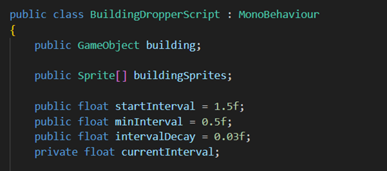
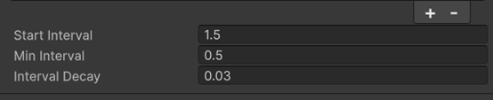

### Observation
With a fixed spawn speed, the game felt predictable and easy to manage once the player understood the rules. After adding the decaying spawn interval, however, the experience changed noticeably.
As the game progressed and buildings began falling more frequently, I felt more pressure to make quick decisions about what to catch and what to avoid. Mistakes happened more often, because there was less time to react and reposition the basket.
As the speed increased, it became much more obvious that the game is built around choosing what to catch and what to avoid. The increasing speed made it much more obvious that the player needs to recognize which objects are worth catching and intentionally avoid others. The difficulty came from decision-making under pressure, not just from reaction speed.

### What I Learned 
This small change showed me how much impact a single numerical system can have on the overall experience. Even though the mechanics stayed exactly the same, the game felt very different once the pacing changed.
I also learned that difficulty does not need to come from adding more features. Simply adjusting timing and rhythm can create a stronger sense of tension and progression, especially in a prototype meant to test a single idea.

### What Worked
I would consider this exploration successful because it clearly demonstrated how a difficulty curve can emerge from a simple system. The prototype helped me understand how pacing influences player behavior and how quickly a game can become stressful or overwhelming when time pressure increases.

### Where I Might Go Next
If I were to continue exploring this idea, I would experiment with fine-tuning the rate at which the spawn interval decreases to find a better balance between challenge and readability. I would also be interested in testing whether clearer visual or audio feedback could help players make faster decisions as the game speeds up.
___

## January 30 – February 4 – Week 3 - Design Journal: Exploration Prototype 2
This week, I modified the example game Pawng that we discussed in class by introducing randomized player inputs. Instead of each player having fixed and reliable controls, the control keys are shuffled at regular intervals during gameplay.
The purpose of this change was to explore whether introducing randomness into a simple competitive game could add moments of surprise or engagement, and under what conditions this randomness begins to feel disruptive rather than playful.

### What I Was Trying to Test
I was interested in observing how players adapt in real time when their inputs are no longer reliable.
Rather than evaluating the game at a high level, I focused on moment-to-moment reactions, especially how players respond when the control scheme changes during active play.
More specifically, I wanted to understand whether randomness could create interest without breaking the player’s sense of agency, and how timing plays a role in how this randomness is perceived.

### What I Did
I kept the core mechanics of Pawng unchanged. I did not add any new rules or objectives. The paddles still move vertically, collide with the ball, and follow the same logic as the original version.
My only change was to the input system. I introduced a timer that randomly reassigns the control keys for each player at regular intervals. To avoid making this change feel hidden or confusing, I added a simple UI element that displays the current key mapping along with a countdown indicating when the next change will occur.

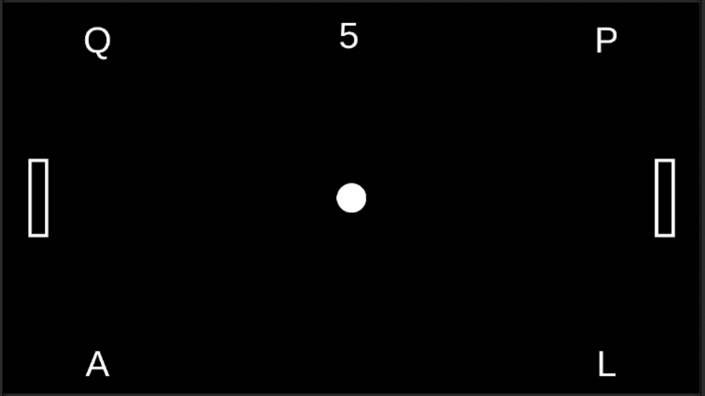

### What I Learned
After implementing this change, I noticed that even a small modification to the input system had a strong effect on how the game was played. In some situations, the randomized input created moments of surprise and tension. When players managed to adapt quickly to the new controls, these moments felt playful and occasionally humorous.
However, I also observed a clear point where the randomness began to feel frustrating rather than engaging. When the key shuffle happened just as the ball was approaching the paddle, players often had too little time to react. In these moments, I noticed that missed shots were usually blamed on the system rather than on player skill.
From this, I learned that randomness itself was not the main issue. Instead, the timing of the randomness was critical. When players felt they had enough time to adjust, the randomness felt challenging but fair. When they did not, it felt arbitrary and disruptive.

### Was It Successful?
I consider the prototype successful because it showed how the timing of randomized input strongly affects player experience. While introducing randomness did create moments of interest, it also revealed how quickly a player’s sense of control and responsibility can break down when that randomness is introduced at the wrong moment.
Rather than trying to make the game “better” overall, this prototype helped me identify a specific design boundary: randomness can enhance play, but only when players are given enough time to respond and adapt.

### Where I Might Go Next
If I were to continue this exploration, I would like to expand the scope of randomness rather than focusing on a single variable.
In this prototype, the randomness was primarily temporal, affecting when player input changed.
The next step would be to introduce an additional randomized variable, such as changes to paddle size, and observe how multiple forms of randomness interact. I would be interested in whether combining these variables amplifies the sense of unpredictability, or whether one form of randomness becomes more noticeable than the other.
This would help explore how much randomness a simple game system can support before it becomes unreadable or overwhelming.
___

## February 5-11 - Week 4 - Design Journal: Exploration Prototype 3
### Idea
This week, I added a new brick property to the original Breakin’ Out game, where some bricks generated by the system cannot be destroyed.
Instead of trying to make the game harder, I wanted to see what happens when levels are generated procedurally, and what kinds of problems show up during play.

### What I Was Trying to Test
I wanted to see what happens when unbreakable bricks are added to procedurally generated levels.
More specifically, I was interested in figuring out which parts of a level layout can be left random to keep the game interesting and replayable, and which parts need some control to avoid frustrating or unexpected situations.

### What I Did
To explore this idea, I modified the brick generation system so that some bricks can be generated as unbreakable. When the level is created, each brick has a chance of becoming an unbreakable brick instead of a normal one. These unbreakable bricks are visually different and when the ball collides with these bricks they are not destroyed and continue to interact with the ball through normal collision physics. They act as obstacles that the player has to work around.
In addition to adding unbreakable bricks, I tested the system across different generated layouts by adjusting the number of rows, columns, and spacing between bricks. This allowed me to observe how the presence of unbreakable bricks affected playability under different layout conditions.

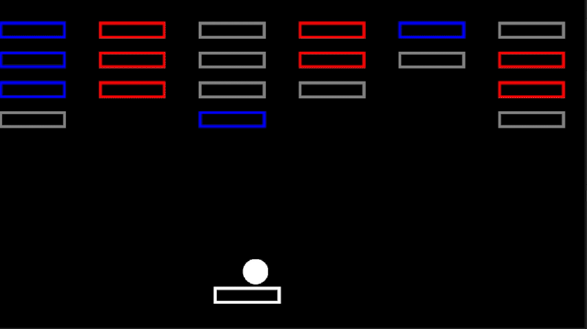

### What I Learned 
Through testing different generated layouts, I started to see that randomness needs to stay within a certain range. When the chance of unbreakable bricks was too low, only one or two would appear, and they barely changed the game. The level felt almost the same every time, which defeated the purpose of procedural generation.
On the other hand, when the chance was too high, the levels became much more chaotic. Large groups of unbreakable bricks would sometimes form, making certain areas very hard to reach. In some cases, the ball would just bounce between unbreakable bricks for a long time, and I felt like the player wasn’t really making meaningful decisions anymore — they were just waiting for the ball to drop or hoping for a lucky angle.

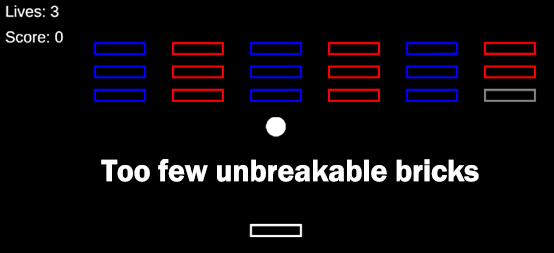
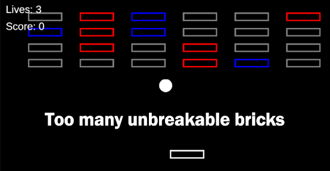

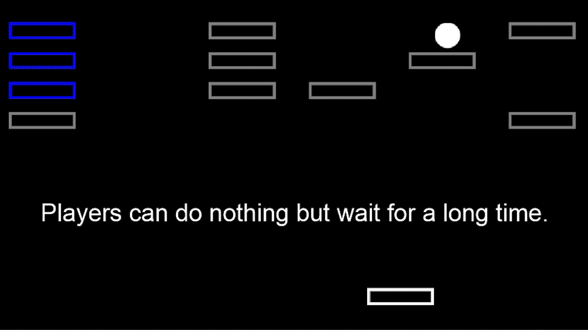

These observations made me realize that procedural generation is not just about whether a level is technically beatable. Even if a level can be completed in theory, it doesn’t necessarily mean it feels fair or enjoyable. If the probability of success becomes too low, the game starts to rely more on luck than on player skill.
From this experiment, I learned that randomness in procedural level generation needs boundaries. Too little randomness makes the game repetitive, but too much can create extreme difficulty spikes and reduce the player’s sense of control.

### Was It Successful?
I consider this prototype successful because it made the problems of procedural generation very visible. By adjusting the probability of unbreakable bricks, I could clearly see when the game felt repetitive and when it became frustrating.
Even though I did not fully optimize the system, the prototype helped me understand that randomness needs structure in order to create levels that feel fair and engaging.

### Where I Might Go Next
If I continue developing this idea, I would like to apply what I learned about controlled randomness to other types of games, such as roguelikes. In those games, procedural generation is often used to determine enemy placement and difficulty.
For example, the proportion of strong enemies versus weaker enemies could be adjusted within a controlled range, similar to how I adjusted the probability of unbreakable bricks. This would help ensure that levels remain challenging but still give players a reasonable chance of success.
This experiment made me more aware that random systems need boundaries, especially when they directly affect difficulty and survival probability.
___

## February 12-18 Week 5 - Design Journal: Exploration Prototype 4
### Idea
In Prototype 3, I focused on procedural level generation and added constraints to unbreakable bricks. The goal was to prevent extreme layouts and keep the game playable while still allowing variation.
This week, I wanted to push the gameplay system further by making it react to the player’s behavior. Instead of keeping the level static, I introduced a performance-based trigger. If the player clears a certain number of bricks within a short time window, the game shifts into a harder mode where the bricks begin to move horizontally and award higher points.
Rather than only adjusting randomness at the generation stage, I wanted to explore what happens when the system dynamically responds to player performance during gameplay.

### What I Changed
Building on the constrained procedural generation from last week, I added a timed performance condition. The system now tracks how many bricks are destroyed within a rolling time window. If the player reaches a target number within that window, the game activates a “hard mode.”
When hard mode is triggered:
* All remaining breakable bricks change color.
* Their point value increases.
* The entire brick layer begins to move horizontally over time.

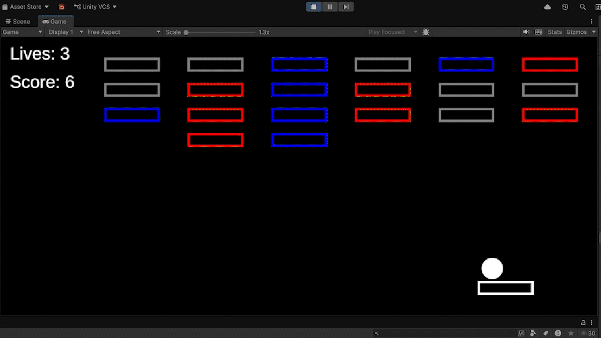

This change transforms the level from a fixed layout into a responsive system that reacts to good performance.

### What This Change Tests
This iteration tests whether performance-based dynamic difficulty can increase challenges while still maintaining a sense of fairness and control.
Instead of only modifying randomness at the generation stage, I wanted to explore how players perceive when the system reacts directly to their performance during play.

### What I Learned
During testing, I noticed that players often felt surprised when hard mode was triggered for the first time. The sudden shift in movement and increased scoring created a sense of excitement. Over time, this mode became something players actively tried to reach again, which increased replay motivation and made the game feel less repetitive.
However, I also realized that the activation condition needs to be carefully balanced. If the requirement to enter hard mode is too difficult, many players may never experience it and may not even realize that such a mode exists. On the other hand, if the condition is too easy, hard mode starts to feel inevitable rather than earned. In that case, the difficulty shift no longer feels like recognition of strong performance, but simply a normal progression of the game.
This made me understand that dynamic difficulty is not only about increasing challenge, but also about designing meaningful thresholds that preserve a sense of achievement.

### Was It Successful?
I consider this prototype successful because it made the impact of performance-based triggers clearly visible. Through testing different conditions, I was able to observe how small changes in the activation threshold significantly affected player motivation and perception.
When the trigger felt challenging but achievable, hard mode became something players actively pursued. However, when the condition was either too strict or too easy, the system lost its intended effect. This confirmed that dynamic difficulty is not only about adding challenge, but about carefully designing when and how that challenge is introduced.

### Where I Might Go Next
While this prototype focused on rewarding strong performance with increased challenge, it also raised another important question: how should the system respond to weaker performance?
If high-performing players are rewarded with hard mode, should players who struggle receive some form of assistance? For example, the game could provide temporary support, such as granting an extra life after repeated failures. Exploring this possibility could become my next step.
___

## February 19-25 - Week 6 - Design Journal: Iterative Prototype 1 (Conceptualizing)
### Combination 1 – Horse Race, Cult
In the first round, our group ended up with horse race and cult. My first instinct was to turn it into a competitive racing game where members of a cult compete and use items to interfere with each other during the race. I was thinking about something like the game Road Rash.

But soon, I felt like it was basically just a racing game with a “cult” skin on top. The cult element didn’t really change how the player experiences the game, and the horse race itself wasn’t doing anything particularly unique. The two words were not actually interacting.

So, I decided to change the structure. Instead of treating both words equally, I chose one to be dominant. I made cult as the core idea and treated the horse race as an event happening inside that world.
In the new version, the player becomes someone who is forced to prepare for a cult’s horse race ritual. The gameplay focuses on preparation tasks, such as feeding the horse, washing it, setting the saddle, all very ordinary actions. However, during these tasks, sudden and violent events can occur. The horse might unexpectedly lash out and kill you. Even overlooking a small detail could lead to death.

The idea was inspired by Shark Dentist, where tension comes from performing a simple action while knowing something could suddenly go wrong. I wanted to bring that structure into my game and create horror by making ordinary actions feel dangerous. Feeding a horse shouldn’t be terrifying, but in my game it is. At the same time, I wanted players to go through repeated, terrifying deaths. Through failure, they would slowly begin to recognize patterns and understand where the danger lies. The horror wouldn’t just come from sudden violence, but from the anxiety of knowing that something is about to go wrong.

I also imagined another layer underneath. While trying to survive these tasks, the player would secretly collect clues and piece together what the cult is actually doing. If the player simply follows instructions and completes everything normally, they reach a bad ending. Only by understanding the logic behind the ritual and carefully sabotaging it can they escape.
This combination made me realize that merging two themes isn’t enough. One of them must actively shape the mechanics and the player’s emotional experience.

### Combination 2 – Crowd, Cooking, Survive, Loot, Cult
In the second round, we formed a group of five, and the final set of words was Crowd, Cooking, Survive, Loot, and Cult. At first, the words felt scattered and overwhelming. 
During the brainstorming process, different members suggested completely different directions. One person imagined a post-apocalyptic exploration game. Another wanted to make a tower defense game about stopping a cult. Someone else suggested a survival game focused on gathering resources on an island. At first, these ideas felt disconnected, but as we kept talking, I started picking up fragments from each of them. And gradually, those fragments began to merge.
The post-apocalyptic setting stayed. The idea of stopping a cult evolved into maintaining order within a city. The survival element became resource management. Instead of focusing on a single character, I imagined the player as the leader of the last surviving city in a ruined world.

In this version, the player manages population, food supply, and public stability. Looting can emerge if food is insufficient. Cult activity can grow if people lose faith in leadership. Cooking becomes part of food production and survival systems. The game was inspired by Frostpunk, especially in how it forces players to make difficult decisions under pressure.

What interests me most about this idea is the tension created by imperfect resource distribution. Resources can never be allocated perfectly. If the player increases food supply to prevent looting, long-term reserves might suffer. If they deny citizens’ demands, cult influence may rise. Random events also disrupt stability, such as population growth, food shortages, or sudden crises. The player never fully knows which resource will be threatened next.

I want the player to feel pressure from uncertainty. Early in the game, everything is scarce, and the situation feels fragile. Over time, if the player manages resources carefully, the city can stabilize. And players’ emotion shift from helplessness to a sense of control.

This idea didn’t show up all at once. It formed gradually through listening to others and collecting pieces of their suggestions. Rather than choosing one direction immediately, I combined small elements from each idea until they began to fit together into a coherent system.

### Combination 3 – Cave, Observation
In the third round, the words were Cave and Observation. my teammate first suggested a concept inspired by a TV series where entering a cave leads to different timelines. The idea was to create a walking simulator where the player explores the cave and observes how the environment changes across time.

At first, I liked the idea of shifting timelines, but I felt that simply walking and observing wouldn’t create enough tension or challenge. It felt too passive. The player would be watching different versions of the same space but not necessarily engaging with it in a meaningful way. However, I wanted to keep the timeline aspect. So, I restructured the idea around interaction instead of exploration alone. In this version, the player has a pair of glasses that allow them to see the cave in the past, present, and future. The core gameplay becomes comparing these timelines and understanding how they connect.
For example, in the present timeline, the cave splits into two paths. There is a sign that indicates the correct direction, but it has been corroded and is unreadable. By switching to the past, the player can see the sign clearly and use that information to navigate in the present. In other situations, the future might reveal the consequences of choosing the wrong path.

I was inspired by the time-shifting level in Titanfall 2. I wanted the time mechanic to function as a logic system rather than just a visual effect.
Visually, I imagine dramatic contrasts between past, present, and future versions of the cave. Emotionally, I want the player to feel the satisfaction of solving layered puzzles and gradually uncovering the story behind the cave. The goal is not only to escape, but to piece together what happened and prevent a future tragedy.

### Prototype
For the prototype, I chose the resource management idea because I wanted to test whether balancing numbers could create tension. Since this game relies heavily on resource distribution and uncertainty, I needed to see how sensitive the system would be to small numerical changes.
I created a simple paper prototype and there were four resources: Food, Population, Cult Influence, and Loot. Each resource started at a fixed value. Every day, the player could increase or decrease one resource by 1. Every two days, a random event card would be drawn, which would increase or decrease certain resources. The goal was to survive 8 days while keeping all four resources within a defined range.

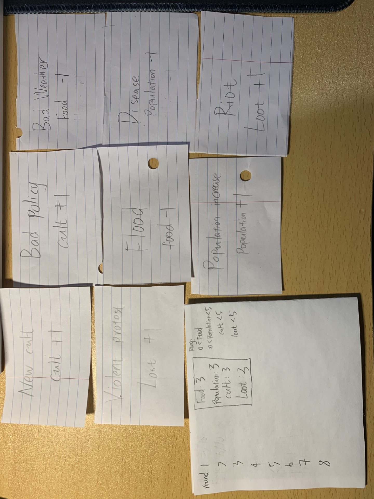

In the first test, the impact of random events was relatively small. The result was that I could pass all 8 days without feeling much pressure. The system felt stable, but it lacked tension. 

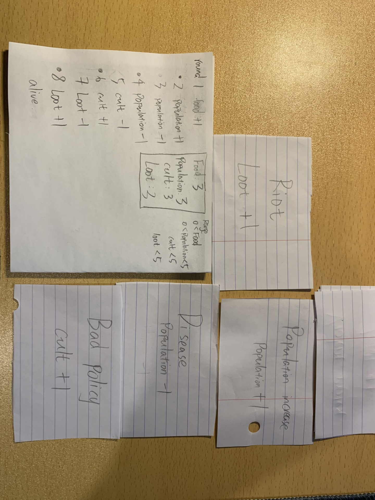

In the second test, I doubled the impact of several random events. This time, the system became much more unstable. By day 6, I failed because two negative events stacked together and pushed the resources out of balance. The pressure was much stronger, but it also felt out of control.

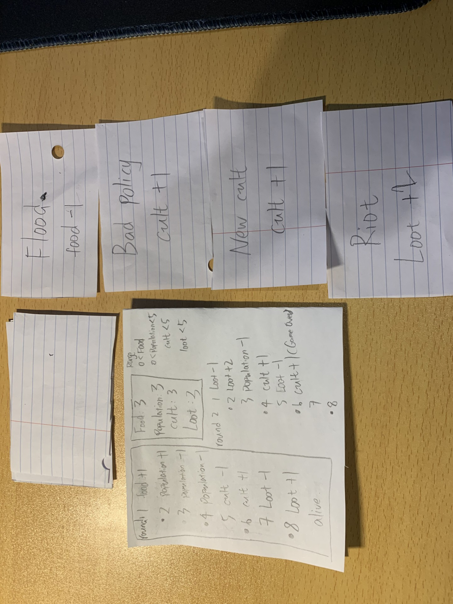

Through this process, I realized that resource balancing is much more complex than I expected. The system needs to create fluctuation to generate stress, but the fluctuations must still allow the player to feel that success is possible. If the numbers are too stable, the game feels boring. If they are too extreme, it feels unfair. The challenge lies in finding the space between stability and collapse.
___

## Journal: Game Analysis
### Mechanics Introduction
In Resident Evil 4 Remake (a survival horror game), there is a dynamic difficulty mechanic that adjusts the game’s difficulty based on the player’s performance. For example, if the player collects a large amount of resources such as ammo or health kits, enemies become harder to kill, forcing the player to consume their saved resources.
In contrast, if the player has a low amount of ammunition, enemies become easier to defeat, and containers are more likely to provide additional resources.

### How This Makes the Game More Interesting
First, the dynamic difficulty system builds a feedback loop that keeps players of different skill levels within a state of flow.

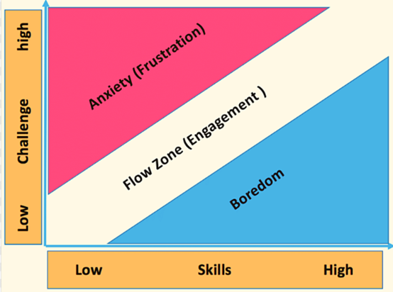

For highly skilled players, the loop works like this: collect resources, eliminate enemies efficiently, accumulate supplies, and repeat. However, as they accumulate more resources, the system increases enemy durability, forcing them to spend what they have saved. This prevents them from drifting into a boredom zone.

At the same time, the limited backpack space acts as an additional balancing mechanism. Even if stronger enemies fail to reduce a player’s resources, inventory constraints force trade-offs. Players may sell items for money, but money can only be used to buy or upgrade weapons, not to directly restore what was sold. This ensures that resource management remains meaningful.

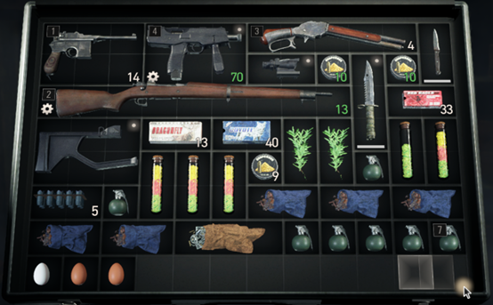

For less skilled players, the loop is different. Because they struggle to conserve resources, they rarely approach a boredom zone. Instead, the system reduces enemy difficulty and increases drop rates, preventing them from falling too deeply into the anxiety zone. As a result, both player types are guided toward a stable flow state.

In addition, this mechanic reinforces the horror experience. Because resource quantities always feel “just enough” to survive the next encounter, the situation remains uncertain. The player is never fully comfortable. This uncertainty sustains tension, which is essential in survival horror. Therefore, the dynamic difficulty system is not only a difficulty management tool, but also an experiential design tool.

### Where Have They Failed
This mechanic can fail once the player becomes aware of it.

If players realize that the system is secretly helping them, they may stop conserving resources. Instead, they might intentionally use more ammo, knowing that lower resource levels will trigger higher drop rates. When this happens, the system shifts from creating tension to becoming something that can be strategically manipulated.

For example, if the player holds a large amount of ammunition, breaking a container may yield 200–500 pesetas. However, if the player’s total ammunition drops below 10 bullets, there is a much higher chance of receiving 10–20 bullets instead. Since each bullet can be sold for 120 pesetas, receiving 10 bullets equals 1200 pesetas, which is more than double the maximum monetary drop.

As a result, a patient player could intentionally sell ammunition before breaking containers in order to maximize profit. In this case, the dynamic difficulty system unintentionally disrupts the game’s economic balance. Once the algorithm becomes predictable, it can be exploited.

### What I Could Borrow for Future Projects
Dynamic difficulty mechanics are something I would like to use in my future projects. In linear games, this approach avoids designing a fixed and static difficulty curve, which would otherwise require long time balancing and testing.

In roguelike projects, dynamic difficulty can provide additional challenges for highly skilled players while offering subtle support for less experienced players during the early stages. This can encourage both groups to continue playing without feeling either bored or overwhelmed.

I am also interested in using dynamic difficulty to shape emotional experience. For example, in a roguelike game, players might believe they were lucky to receive a health potion. In reality, the system may have adjusted the drop rate based on their condition. If implemented carefully, dynamic difficulty can create a sense of fortune and unpredictability without breaking immersion.
___

## March 5-11 - Week 8 - Design Journal: Iterative Prototype 2
This week I wanted to explore the concept for our horror prototype. Instead of focusing on the enemy mechanic itself, I explored how the environment could contribute to the atmosphere of the game.

The design question I wanted to investigate was: Can repetitive environmental elements create tension or discomfort in a horror environment?
The project I am currently developing with Tianshun is a horror game prototype. (https://github.com/Alibaba1555/CART315-TOTAL/blob/main/Process/Journal.md#week-6--design-journal-iterative-prototype-1) I wanted to minimize the time spent building complex levels while still maintaining a strong horror atmosphere.

This prototype mainly functions as a look/feel prototype, since the goal was to explore spatial atmosphere rather than gameplay systems. I created a small digital prototype using several repeating corridors. The layout itself was intentionally very small and repetitive. Several corridor segments with similar shapes were connected to simulate a maze-like space. The goal was not to build a complex level, but to observe how repetition affects the perception of the environment.

I created two versions of the same space. The first version used only basic geometry without any wall textures. This version allowed me to observe the spatial structure of the corridor without visual detail. In the second version, I added simple wall materials to make the space feel more realistic. The overall layout remained the same, but the visual surfaces of the environment became more detailed.

<b>Version 1 – Greybox Environment</b>  

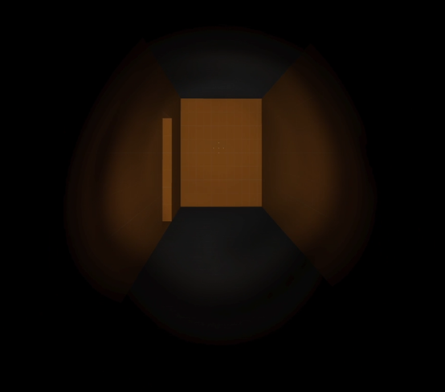
  
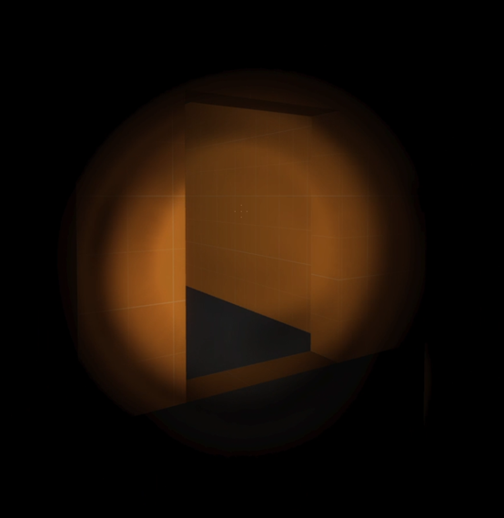

  

<b>Version 2 – Textured Environment</b>  

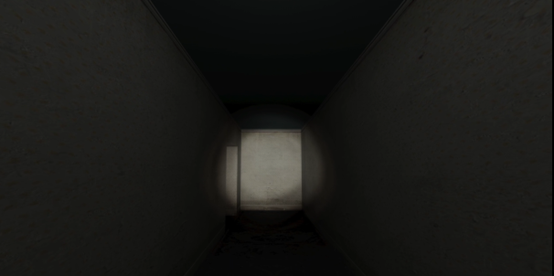
  
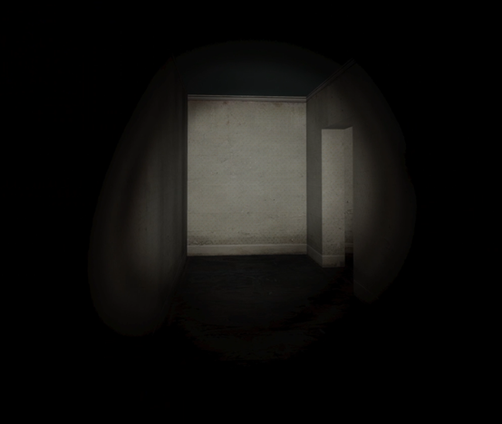

During testing, I noticed that even though the environment was very small, the repeated corridor structures made it slightly difficult to maintain a clear sense of orientation. Because many sections looked similar, it was harder to remember exactly where I had previously moved. The difference between the two versions was also noticeable. The version without textures made players more likely to get lost, but the environment felt too artificial to create much horror atmosphere. However, once the wall materials were added, the corridor started to feel more enclosed and uncomfortable. Even though the layout did not change, the added surface detail made the environment feel more believable and slightly more unsettling. 

This suggests that repetitive elements can indeed help create a sense of horror atmosphere. First, repetition creates a feeling of disorientation. Regardless of whether textures are present, the similarity between corridors makes it difficult for players to remember the paths they have already taken. Second, it can create a sense of unease, which is more related to environmental detail. When players see realistic materials, they subconsciously compare the space to real corridors, and the subtle differences from reality can make the environment feel unsettling.

For our project, this experiment suggests that the level design can remain simple and repetitive, as long as a certain level of environmental realism is maintained.

In this prototype, I used the default flashlight provided by the engine to quickly test the environment. However, during testing we realized that lighting itself can be an important part of the horror atmosphere. Because of this, the next step will be to explore different lighting setups and observe how lighting can influence the tension and mood of the space.

___
In a second small prototype, I explored whether simple methods could be used to create enemy movement that feels like patrol behavior. The goal was to see if convincing enemy movement could be achieved without complex AI systems.

I tested two different approaches in a top-down environment. In the first method, the enemy changes its movement direction randomly after a random amount of time. This creates a strong sense of unpredictability and randomness. However, when the enemy reaches a wall, it sometimes stops moving because it cannot continue forward. This behavior feels slightly unrealistic and breaks the illusion of a patrol.

The second method was inspired by the movement of the ball in the game Pong. In this version, the enemy moves in a straight line and changes direction whenever it collides with a wall. Although this behavior appears more regular and predictable, the enemy never becomes stuck against a wall. Because it keeps moving continuously, the overall effect still feels similar to a patrol behavior within the space.

This experiment also suggests that creating the impression of enemy patrol behavior does not rely only on the enemy’s movement logic, but also on how the environment is designed. For example, the first method may work better if the enemy is restricted to a smaller area, where stopping after hitting a wall can feel more natural. In contrast, the second method may be more suitable for larger spaces, where the continuous bouncing movement can create the impression that the enemy is patrolling across a wider area.
___

## March 12-18 - Week 9 - Design Journal: Iterative Prototype 3

### Core Design Value
In this prototype, my core design value is exploration. I wanted to create a system that responds to player curiosity. When players notice something unusual in the environment and choose to interact with it, the system provides some form of reward. This reward could take different forms, a useful item, access to a new path, or an enemy. I focused on how simple environmental interactions can lead to discovery. For example, players can pick up jars that initially block their path. By interacting with these objects, they may uncover new routes that were not immediately visible. This turns obstacles into opportunities for exploration rather than simple barriers.

### What I Was Trying to Test
The main goal of this prototype was to test the technical feasibility of implementing an interaction system where the player can pick up and move pots.
At the same time, I wanted to explore whether this type of interaction could support my core design value of exploration. Specifically, I was interested in whether removing obstacles through interaction could be used to reveal new paths and create moments of discovery.
This prototype therefore focuses on both whether the system can be implemented reliably, and whether it has the potential to support a curiosity-driven interaction loop.

### What I Did
To explore this idea, I created a system that lets the player pick up pots that are blocking the path.
At first, I thought about just moving the pots out of the way. But this quickly became a problem, because the level layout is not designed yet. If I forced the pots to move in a certain direction, they might end up inside walls or other objects.
So instead, I changed the idea and let the player pick up the pots. This gives the player more control and makes the interaction feel more natural.
After that, I ran into another set of problems, such as what should the animation be when the pot is picked up, how the player should put it back down, and how to set the collision of the pots. To keep things simple, I turned off the pot’s collision while it is being carried, so it doesn’t cause weird physics issues.
For putting the pot back, I thought about different options like placing it down or throwing it. Because of time limits, I decided to only implement a throwing action. I also felt this was a better choice, since throwing could later be used for other gameplay purposes, like damaging enemies, instead of just placing the pot.
For the pickup animation, I didn’t try to build everything from scratch since it was a bit beyond my current technical level. Instead, I looked up existing solutions and used a curved motion based on a cubic Bézier path, which worked well enough for this prototype.

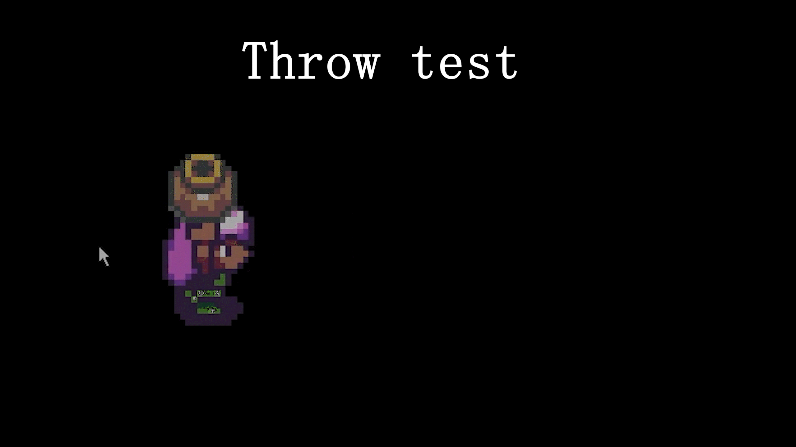

### Type of Prototype
This is mainly an implementation prototype, as I focused on building and testing an interaction system. The goal was to see whether the pot interaction could be implemented in a functional way.

### Fidelity
The prototype is at a low-to-mid fidelity level. The focus is on functionality rather than visual polish. The interaction system is working, but the level design and visual presentation are still very simple and not finalized.

### What I Learned
Through this prototype, I realized that even a simple interaction system can involve many more problems than expected, such as collision handling, animation, and object behavior. These issues take time to solve, and the cost of implementation becomes an important factor in the design process.
More importantly, this made me understand the importance of having a clear core design value from the beginning. When deciding whether to implement a feature, it is not just about whether the idea is interesting, but whether it actually supports the core design value.
In this case, I had to constantly ask myself whether each decision helped reinforce exploration, or if it was adding unnecessary complexity. This helped me avoid adding too many features that might seem interesting but do not meaningfully contribute to the intended experience.
Overall, this prototype made me more aware that design is not only about adding ideas, but also about making decisions and trade-offs based on what matters most.

### Next Steps
For the next step, I see two main directions to continue exploring this idea.
The first is level design. In this prototype, picking up pots to reveal new paths only works if the environment is designed in a way that supports discovery. This means I need to experiment with how to place obstacles and hidden paths so that players are encouraged to explore.
The second direction is camera design. The camera’s visible range affects how much the player can see, which directly influences curiosity and exploration. If too much is visible, the player may not feel the need to explore, but if too little is visible, they may miss important cues.
Both of these directions could help strengthen how the system supports exploration.
___

## March 19-25 - Week 9 - Design Journal: Iterative Prototype 4

### Goal
So far, my prototyping process has been focused on exploring how simple mechanics and interactions can support player exploration. Earlier prototypes focused more on system-level ideas, such as randomness and dynamic difficulty. Over time, my focus shifted toward player interaction and how players engage with the environment.

Last week, I tried to explore how multiple mechanics can work together to guide player behavior. Specifically, I was interested in whether combining interaction (pots), hidden information (a switch), visual control (camera), and constraints (a locked door) could create a stronger sense of exploration.

### What I Did
Last week, I expanded my previous interaction system by adding a door and switch mechanic. When the player enters a room, the door closes, and the player must find a hidden switch to open it. 

The switch is placed under a pot, which builds on the interaction system from the previous prototype. The player needs to pick up the pot to reveal the switch and progress. To leave the room, the player needs to find the correct pot among several pots that hides the switch. This requires the player to actively explore different possible interactions instead of immediately knowing the solution.

I also experimented with different camera setups, since the visible area affects what the player can notice and interact with. In one version, the player can see all the pots immediately after entering the room. In another version, the player needs to move further into the space before the pots become visible. This allowed me to test how visibility influences player exploration.

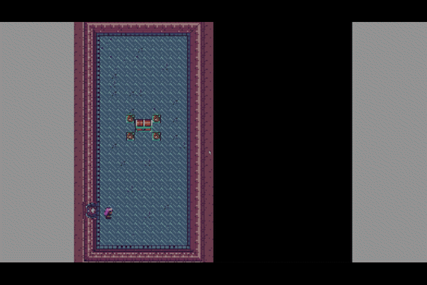

### Type of Prototype
This is mainly an implementation prototype, since I focused on building and connecting different gameplay systems. It also includes elements of a role prototype, as these systems directly influence how the player behaves and explores the space.

### Fidelity
The prototype is at a low-to-mid fidelity level. The core systems and spatial structure are implemented, but the level design is still very basic and not finalized.

### What I Learned
First, I learned that camera control should serve the intended player experience. The way the camera reveals information can directly influence how players explore a space.

In my previous idea, I designed a level where the layout is mostly symmetrical, with small asymmetrical elements guiding exploration. In that case, the camera should show as much of the space as possible, so players can notice these unusual points and feel encouraged to investigate them.

However, in this week’s prototype, the situation is different. The player is locked inside a room and needs to figure out how to escape. I wanted to create a feeling of being trapped and exploring the unknown. Because of this, the camera should limit how much of the room is visible, so the player does not immediately understand the entire space.

Second, I realized that combining different mechanics can strengthen the sense of exploration and player engagement. In theory, the switch could be placed in a visible position, and the system would still function. However, this would feel more like the player is simply following instructions set by the designer.
By hiding the switch under a pot, the interaction becomes something the player discovers through their own actions. This creates a more active experience, where the player feels that progress comes from exploration rather than being directly guided.

### Next Steps
As a next step, I plan to explore adding a reward system to support optional exploration.

In the current prototype, exploration is more forced, since the player must find the hidden switch to leave the room. However, I think exploration in a level should also include optional elements, where the player can choose whether or not to engage.
For example, instead of only using hidden interactions as a requirement, I could introduce additional rewards such as items and stat boosts that are not necessary for progression. This would allow players to explore at their own pace and feel rewarded for their curiosity, rather than being required to explore in order to continue.
___
